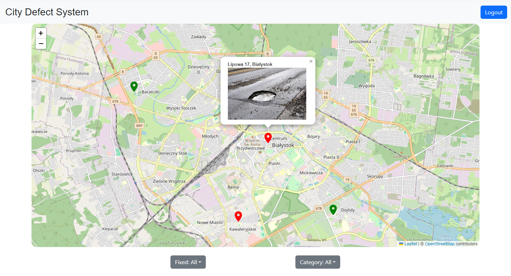
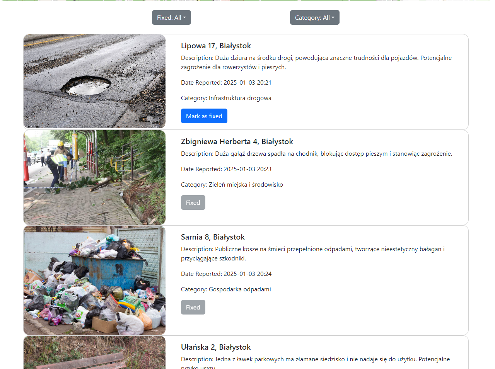

# Photo Based Issue Reporting

Photo Based Issue Reporting is a project consisting of a mobile and web application designed to facilitate the reporting and management of city issues by citizens and administrators. The application enables users to easily report problems in their community using photos, while administrators can manage these reports efficiently through a dedicated web interface. The key features include: 

<ul>
    <li><strong>Issue Reporting:</strong> Users can report city issues by uploading photos and providing descriptions. The reports can include details such as the image, location, and additional notes to help city administrators take appropriate action.</li>
    <li><strong>Photo Upload and Storage:</strong> Photos of reported issues are securely uploaded and stored using Cloudinary, ensuring efficient and reliable media management.</li>
    <li><strong>AI-Powered Categorization:</strong> The system is designed to use AI for automatic categorization of reported issues based on the uploaded photos and descriptions. Feature realized using Gemini Api.</li>
    <li><strong>User Authentication:</strong> The application requires user authentication using JWT (JSON Web Tokens) for secure access and management of reports.</li>
    <li><strong>Administrator Management:</strong> City administrators have access to a web application where they can view, manage, and respond to reported issues. The web app provides a comprehensive dashboard for efficient issue tracking and resolution.</li>
    <li><strong>Reverse Geocoding:</strong> The mobile application includes reverse geocoding to automatically determine and attach the location of the reported issue based on the user's position.</li>
    <li><strong>Interactive Map:</strong> The web application integrates Leaflet to display reported issues on an interactive map, helping administrators visualize the locations and statuses of various reports.</li>
</ul>

# Architecture Diagram

# Database Model

# Technologies
<ul>
    <li>.NET Core</li>
    <li>Entity Framework Core</li>
    <li>Microsoft SQL Server (MSSQL)</li>
    <li>Identity Library</li>
    <li>JWT (JSON Web Tokens)</li>
    <li>React Native</li>
    <li>Cloudinary</li>
    <li>Reverse Geocoding</li>
    <li>React (JavaScript)</li>
    <li>Leaflet</li>
    <li>Gemini API</li>
</ul>

# Screenshots

### Mobile App Login/Register Form

<table>
  <tr>
    <td></td>
    <td></td>
  </tr>
</table>

### List of defects and defect details

<table>
  <tr>
    <td></td>
    <td></td>
  </tr>
</table>

### Add Defect Form and Location Request

<table>
  <tr>
    <td></td>
    <td></td>
  </tr>
</table>

### Web App Main Page

### Web App Defect List

# Add Defect Sequence Diagram
## Backend

## Frontend

